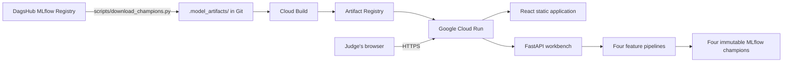

# Google Cloud deployment

## What is hosted

The submission runs as one production container on Google Cloud Run:



The `Dockerfile` builds the React app, installs `requirements-serving.txt`, and copies `src/`,
`backend/`, the frontend build and the four champion copies from `.model_artifacts/` into the image.
It points `TFD_MODEL_URI_*` at those copies, so inference needs no DagsHub credentials or network
access. The browser calls `/api` on the same origin, so there is no CORS to configure.

The champion copies are version 1 of each registered model, downloaded by
`scripts/download_champions.py` and committed to the repository even though `.gitignore` lists
`.model_artifacts/`. Without its own ignore file, `gcloud builds submit` would apply `.gitignore`
and leave them out; the committed `.gcloudignore` keeps them in the upload and leaves out data,
notebooks, docs and tests.

## Rehearse locally

The same `Dockerfile` builds and runs on any machine with Docker:

```bash
docker build -t tfd-gcp:local .
```

```bash
docker run --rm -p 8080:8080 tfd-gcp:local
```

Then open http://localhost:8080.

## Prepare the project

Open the assigned project in Google Cloud Console. Do not install or authenticate a local SDK, and
never put a Qwiklabs password, service-account key or access token in this repository.

Use the Console's **Activate Cloud Shell** button and run the commands below there. Cloud Shell is
already authenticated to the lab project; check the project shown in its prompt before continuing.

```bash
gcloud config set project PROJECT_ID
gcloud config set run/region us-central1
gcloud services enable run.googleapis.com artifactregistry.googleapis.com cloudbuild.googleapis.com
gcloud artifacts repositories create train-fault-detection --repository-format=docker --location=us-central1
```

## Build and deploy from Cloud Shell

Clone the submitted commit, then build with Cloud Build and deploy, all inside the project:

```bash
git clone https://github.com/kaz-uuu/lta-train-fault-detection.git
cd lta-train-fault-detection
git checkout COMMIT_SHA
gcloud builds submit --tag us-central1-docker.pkg.dev/PROJECT_ID/train-fault-detection/app:COMMIT_SHA .
gcloud run deploy train-fault-detection --image us-central1-docker.pkg.dev/PROJECT_ID/train-fault-detection/app:COMMIT_SHA --region us-central1 --platform managed --allow-unauthenticated --cpu 2 --memory 2Gi --timeout 300
```

Tag images with the Git commit SHA so each one is immutable. To roll back, send traffic to an
earlier revision:

```bash
gcloud run services update-traffic train-fault-detection --to-revisions=REVISION_NAME=100 --region us-central1
```

Runs, like assistant conversations, live in the container's memory, so they are lost when Cloud Run
restarts or replaces an instance.

The maintenance assistant runs offline in this deployment unless its Vertex AI variables are set;
see [AGENTIC_ASSISTANT.md](AGENTIC_ASSISTANT.md).

## Proof for judging

1. Open the Cloud Run HTTPS URL and confirm the React workbench loads.
2. Open `/api/health`; it must return `{"status":"ok"}`.
3. Upload one official Test file for each subsystem and confirm all four subsystems show a prediction.
4. Download `predictions.zip` and check it holds `door_predictions.csv`, `acv_predictions.csv`,
   `rail_predictions.csv` and `shm_predictions.csv`.
5. In Cloud Run, show that the active revision uses the Artifact Registry image tagged with the
   submitted Git commit.
