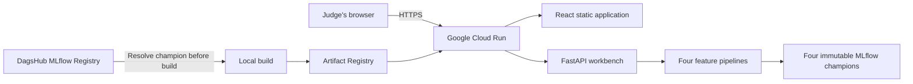

# Google Cloud deployment

## What is hosted

The submission is deployed as one production container on Google Cloud Run:



This hosts the frontend, backend, preprocessing logic, and model inference on Google Cloud. The
browser calls `/api` on the same origin. Runtime inference does not require DagsHub credentials or
network access because the four reviewed champion versions are baked into the image.

## One-time project setup

Never put a Qwiklabs password, service-account key, or access token in this repository. Authenticate
interactively with `gcloud auth login`, then select the assigned project.

```bash
gcloud config set project PROJECT_ID
gcloud config set run/region us-central1
gcloud services enable run.googleapis.com artifactregistry.googleapis.com
gcloud artifacts repositories create train-fault-detection --repository-format=docker --location=us-central1
gcloud auth configure-docker us-central1-docker.pkg.dev
```

## Build and deploy

First authenticate to DagsHub locally and snapshot the registered champions. `.model_artifacts` is
Git-ignored but deliberately included in the Docker build context.

```bash
python scripts/download_champions.py
docker build -t tfd-gcp:local .
docker tag tfd-gcp:local us-central1-docker.pkg.dev/PROJECT_ID/train-fault-detection/app:COMMIT_SHA
docker push us-central1-docker.pkg.dev/PROJECT_ID/train-fault-detection/app:COMMIT_SHA
gcloud run deploy train-fault-detection --image us-central1-docker.pkg.dev/PROJECT_ID/train-fault-detection/app:COMMIT_SHA --region us-central1 --platform managed --allow-unauthenticated --cpu 2 --memory 2Gi --timeout 300
```

Use an immutable Git commit SHA as the image tag. Cloud Run revisions provide rollback without
overwriting a known-good image.

## Proof for judging

1. Open the Cloud Run HTTPS URL and confirm the React workbench loads.
2. Open `/api/health`; it must return `{"status":"ok"}`.
3. Upload one official test file for each subsystem and confirm all four cards show a prediction.
4. Download `predictions.zip` and inspect the four required CSV names.
5. In Cloud Run, show that the active revision uses the Artifact Registry image tagged with the
   submitted Git commit.

The local pre-deployment rehearsal uses the exact same image, not a separate development server.
